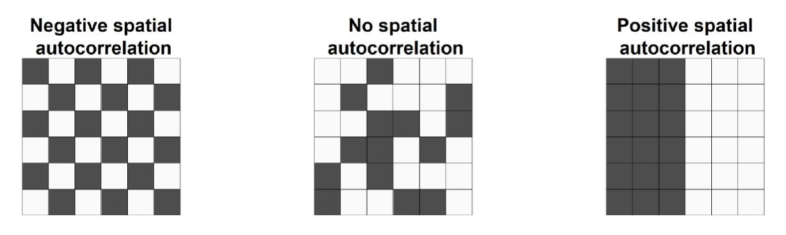

---
format:
  html:
    # theme: solar
    toc: true
    toc-expand: 2
    toc-location: left
    # code-fold: truexs
    embed-resources: true
    number-sections: true
    comments:
      hypothesis: true
    other-links:
      - text: "Presentation Slides"
        href: "https://alvinbjl.github.io/school-disparity-areal-model/presentation/"
      - text: "Poster for KAUST Statistic Workshop 2025"
        href: "https://alvinbjl.github.io/school-disparity-areal-model/poster.pdf"

  pdf:
    documentclass: article
    fontsize: 12pt
    geometry: margin=2cm

  docx:
    link-citations: true

title: "Bayesian Spatial Modeling of School Disparities in Brunei Darussalam"
# Spatial Inequalities in Educational Infrastructure: Bayesian Hierarchical Modelling of School Availability Across North Borneo
      
author:
  - name: Alvin Bong
    email: alvinbongjl@gmail.com
    # affiliations:
    #   - name: Universiti Brunei Darussalam
    #     id: ubd
    #     department: Mathematical Sciences, Faculty of Science
    #     address: Universiti Brunei Darussalam, Jalan Tungku Link
    #     city: Bandar Seri Begawan
    #     country: Brunei
    #     postal-code: BE 1410
    attributes:
      corresponding: true
date-modified: 2025-10-13
bibliography: 
  - refs.bib
abstract: |
  Understanding the spatial distribution of schools is essential for promoting equitable access to education. This study investigates spatial disparities in school availability across Brunei Darussalam, with the aim of identifying potentially underserved areas. An initial exploratory data analysis (EDA) was conducted to examine school counts across mukims. The core analysis applie Bayesian spatial Poisson model using Integrated Nested Laplace Approximation (INLA) to estimate the relative abundance of schools, adjusting for expected counts based on population, size of geographic area, and a socioeconomic indicator (median house price, partially simulated). Both spatially structured and unstructured random effects were included to account for latent spatial processes. Posterior estimates revealed several mukims with significantly lower school availability relative to the national baseline, offering valuable insights to support future policy planning and equitable school placement.

# Understanding the spatial distribution of educational infrastructure is essential for ensuring equitable access to schooling. This study examines regional disparities in school availability across Brunei and the neighboring Malaysian states of Sarawak and Sabah, with a focus on identifying potential underserved areas. First, exploratory data analysis (EDA) was conducted to compare school counts and student-teacher ratios at the district level across the three regions. The core analysis employs Standardized Incidence Ratio (SIR) and Bayesian spatial Poisson model using Integrated Nested Laplace Approximation (INLA) to estimate the relative abundance of schools across Brunei’s districts, adjusting for expected counts based on population, region size and socioeconomic indicator (house price + partially simulated). Spatially structured and unstructured random effects were incorporated to account for latent spatial processes. Posterior estimates identified districts with significantly lower school availability than the national baseline, supporting future policy planning and school placement.
---

```{r}
#| label: setup
#| include: false
library(tidyverse)
library(ggplot2)
library(mapview)
# Reorder OpenStreetMap as default
all_basemaps <- c("OpenStreetMap", 
                  "CartoDB.Positron",  
                  "CartoDB.DarkMatter", 
                  "Esri.WorldImagery", 
                  "Esri.WorldStreetMap") 
# Set default basemap to OSM
mapviewOptions(basemaps = all_basemaps)
mapviewOptions(fgb = FALSE)
library(bruneimap)
library(geodata)
library(sf)
library(viridis)
library(spdep)
library(INLA)
library(leaflet)
library(leaflet.extras2)
library(RColorBrewer)
library(patchwork)
set.seed(123)

#  Data: Primary & secondary Schools, Population, sf ----------
#  Fix school on water village (slightly out of bound)
brn_sch_sf <- bruneimap::sch_sf %>% 
  mutate(district = case_when(
    School == "Sekolah Rendah Tanjong Kindana" ~ "Brunei-Muara",
    TRUE ~ district
  )) %>% 
  mutate(mukim = case_when(
    School == "Sekolah Rendah Tanjong Kindana" ~ "Mukim Kota Batu",
    TRUE ~ mukim
  ))

# Filter Only Primary, Secondary Government Schools
brn_mkm_sch_df <- brn_sch_sf %>% 
  filter(Sector == "MOE") %>% 
  select(School, Education.Level, kampong, mukim, district) %>% 
  filter(!Education.Level %in% c("Vocational / Technical Education", 
                                 "Higher Education",
                                 "Pre-primary",
                                 "Technical / Vocational Institution",
                                 "Vocational / Technical  Education")) %>% 
  group_by(mukim) %>% 
  summarise(schools = n()) %>% 
  st_drop_geometry()

# Join population
mkm_pop <- bruneimap::census2021 %>% 
  group_by(mukim) %>% 
  summarise(population = sum(population, na.rm = TRUE))

# Join youth population
pop_youth <- read_csv("source/census_2021_age.csv")
pop_youth <- 
  pop_youth |>  
  mutate(population_youth = `Male 00-14` +
                            `Female 00-14` +
                            `Male 15-24` +
                            `Female 15-24`) |> 
  select(mukim, population_youth)

# Join sf
brn_mkm_sch_sf <- left_join(mkm_sf, brn_mkm_sch_df, by="mukim") 
brn_mkm_sch_sf <- left_join(brn_mkm_sch_sf, mkm_pop, by="mukim")
brn_mkm_sch_sf <- left_join(brn_mkm_sch_sf, pop_youth, by="mukim")
```

## Introduction
Education is a foundational pillar of national development and its people, influencing social well-being, economic growth, and long-term sustainability. The global significance of education is recognized in Sustainable Development Goal 4, which promotes inclusive and equitable quality education for all [@UNGA2015transform]. Nationally, Brunei Darussalam’s national vision, Wawasan Brunei 2035, positions education as a cornerstone of the country's long-term development goals [@GovernmentBruneiNDwawasan]. Ensuring equitable access to education through sufficient infrastructure and fair resource distribution is critical to delivering quality learning experiences.

While several studies have examined general aspects of education in Brunei, there have been limited studies based on quantitative methods [@ebil2023overview; @abdul2021development; @salbrina2024education; @mohamad2018towards]. This project aims to addresses that gap by conducting spatial analysis on schools across the mukims in Brunei, specifically using Bayesian hierarchical models to identify adminstrative regions in Brunei where school availability falls significantly below the national baseline, supporting future policy planning and school placements. 

<!-- The rest of this paper is organized as follows. In section -->
<!-- [2](#sec-method){reference-type="ref" reference="sec-method"}, we -->
<!-- describe the methodology used. In section -->
<!-- [3](#sec-results){reference-type="ref" reference="sec-results"}, the -->
<!-- results are shown. In section [4](#sec-conc){reference-type="ref" -->
<!-- reference="sec-conc"}, we conclude. -->

## Data
This study focuses exclusively on government primary and secondary schools in Brunei Darussalam, as these institutions serve as the main access points to education for most youth. Bayesian spatial modeling was conducted using Brunei’s 39 mukims (administrative region) as the unit of analysis (areal analysis) to achieve a balance between geographic detail and interpretability. Key data variables that were used include *school counts*, *administrative boundary data*, *population*,  and *house prices*. These datasets were mostly sourced from Bruneiverse Github Page, particularly via the `bruneimap` R package, and were subsequently cleaned, wrangled, and merged primarily using `left_join()` and `rbind()` [@bruneimap; @jamil2025archives].

The school dataset from 2018 was used as it is the most recent year for which disaggregated school-level data is available. Although more recent statistics exist, they are published only in summary form. Population data is drawn from the 2021 national census, the most recent census available in Brunei, despite the mismatch in years with the school dataset. Brunei conducts its national census every ten years, making the 2021 data the best option for population estimates.

To incorporate a socioeconomic indicator, we used spatiotemporal trend in average house prices from the existing literature [@jamil2025spatiotemporal]. These were calculated at the mukim level and included as a covariate in the Bayesian model. In cases where house price data were missing, values were imputed using predictions from an INLA-based Gaussian model. Manual imputations based on local knowledge were initially tested, but the INLA-predicted values were ultimately adopted, as both methods produced similar model outcomes. Given the nature of the data, house prices were treated as partially simulated estimates and may not fully reflect actual market values.


## Methods {#sec-method}
Choropleth map is used for exploratory data analysis to give an overview of school counts per mukim and overall geography of Brunei.

### Spatial regression model
Let $Y_i$ and $E_i$ denote the observed and expected counts of schools, respectively, in mukim $i \in \{1, \dotsc, n\}$. Let $\theta_i$ represent the *relative abundance* of schools in mukim $i$, analogous to a relative risk in disease mapping. The Bayesian hierarchical model [@banerjee2003hierarchical], incorporating spatial Besag-York-Mollié (BYM) model [@besag1991bayesian] is specified as follow:

$$
Y_i \mid \theta_i \sim \text{Poisson}(E_i \cdot \theta_i), \quad i = 1, \dotsc, n
$$

$$
\log(\theta_i) = \beta_0 + \beta_1 \cdot \text{pop youth}_i + \beta_2 \cdot \text{area}_i + \beta_3 \cdot \text{hp}_i + u_i + v_i,
$$

where:

- $\beta_0$ is the intercept,
- $\beta_1$, $\beta_2$, and $\beta_3$ are regression coefficients for the standardized covariates:
  - $\text{pop youth}_i$: population youth aged 0-24 (in units of 10,000),
  - $\text{area}_i$: mukim size (in units of 10 km²),
  - $\text{hp}_i$: spatiotemporal trend in average houseprice,
- $u_i$ is a structured spatial effect, modelled using an intrinsic conditional autoregressive (CAR) prior $u_i \mid u_{-i} \sim \mathcal{N}(\bar{u}_{\delta_i}, \frac{1}{\tau_u n_{\delta_i}})$
- $v_i$ is an unstructured random effect, $v_i \sim \text{Normal}(0, \frac{1}{\tau_v})$

The spatial random effect $u_i$ requires a neighborhood (adjacency) matrix. Here, We define two mukims as neighbors if they share at least one boundary point (Queen contiguity). The neighborhood graph is constructed using the `poly2nb()` function from the `spdep` package. 

Model fitting was performed in a Bayesian framework using the Integrated Nested Laplace Approximation (INLA) [@rue2009approximate]. Model adequacy with respect to spatial structure is assessed by by examining the spatial autocorrelation ofstandardiszed Pearson residual defined as:
$$residual_i = \dfrac{Y_i - \mu_i}{\sqrt{\mu_i}} = \dfrac{Y_i - E_i \cdot \theta_i}{\sqrt{E_i \cdot \theta_i}},$$
where $Y_i$ is the observed count, $E_i$ is the expected count (offset), and $\theta_i$ is the relative risk. Significant residual spatial autocorrelation may indicate unaccounted spatial structure in the model.

The expected counts are computed using indirect standardization: 
$$E_i = \sum_{j=1}^{n} Y_j \cdot \frac{\text{pop}_i}{\sum_{j=1}^{n} \text{pop}_j}$$

### Global Moran's I 
To examine whether Pearson residuals of our model exhibit a clustered, dispersed, or random spatial pattern, we apply the Global Moran’s I test using the `global_moran_test()` function from the `spdep` package. This test is computed for each mukim in the study area, indexed by $i, j = 1, 2, \ldots, N$. The Moran’s I test statistic is defined as follows:

$$
I = \frac{N}{\sum_{i=1}^N \sum_{j=1}^N w_{ij}} \frac{\sum_{i=1}^N \sum_{j=1}^N w_{ij} (x_i - \bar{x})(x_j - \bar{x})}{\sum_{i=1}^N (x_i - \bar{x})^2} \in [-1,1],
$$

where:

-   $x_i$ is the Pearson residual in mukim $i$,
-   $\bar{x}$ is the mean residual per mukim,
-   $w_{ij}$ is the spatial weight between mukims $i$ and $j$.

For simplicity, the same Queen Contiguity neighbour is used. Moran’s I values are standardized, with values close to $+1$ indicating positive spatial autocorrelation (i.e., clustering), where high or low values are near each other. Values close to $-1$ indicate negative spatial autocorrelation (i.e., dispersion), where neighboring values differ significantly. Values near $0$ suggest randomness, indicating an absence of spatial pattern. @fig-autocorrelation shows the three configurations of areas.

{#fig-autocorrelation}

To determine the significance of the Moran’s I statistic, we employ the Central Limit Theorem to calculate p-values based on a Z-score, allowing us to test the following hypotheses:

-   $H_0: I = 0$ (no spatial autocorrelation),
-   $H_1: I \neq 0$ (presence of spatial autocorrelation).

## Results {#sec-results}

### Exploratory Data Analysis
@fig-sch shows that mukims with higher schools count located in the coastal region near South China Sea. As expected, majority of mukims with high school count are in Brunei-Muara District (north-east of mainland), the most populated and urban district in Brunei.

```{r}
#| label: fig-sch
#| fig-cap: "Choropleth Map of school count by mukim. Grey boundaries denote mukim. Thicker white boundaries are the 4 districts in Brunei."

label_sf <- brn_mkm_sch_sf |> 
  arrange(desc(schools)) |> 
  slice_head(n = 5) |> 
  mutate(label = paste0(mukim, "\n", schools))
ggplot() +
  geom_sf(data = brn_mkm_sch_sf, aes(fill = schools)) +
  geom_sf(data = mkm_sf, color="grey", alpha=0, linewidth=0.5) +
  geom_sf(data = dis_sf, color="white", alpha=0, linewidth=0.8) +
  ggrepel::geom_label_repel(
    data = label_sf,
    aes(label = label, geometry = geometry),
    stat = "sf_coordinates",
    inherit.aes = FALSE,
    box.padding = 1,
    size = 6,
    alpha = 0.7,
    force=5,
    max.overlaps = Inf
  ) +
  scale_fill_viridis_b(
    option = "mako",
    direction = 1,
    name = "Schools Count",
    na.value = NA,
    breaks = c(0,2,4,6,8)    # Number of bins
  ) +
  labs(x = NULL, y = NULL) +
  theme_void()
```

### Model {#sec-results-model}

```{r}
#| include: false
  #  Model covariate: house price --------------------------
hp <- read_csv("source/house_price_phi.csv")

# replace NA schools <= 0
brn_mkm_sch_sf$schools[is.na(brn_mkm_sch_sf$schools)] <- 0

# join
brn_mkm_sch_sf <- left_join(brn_mkm_sch_sf, hp, by = "mukim")
brn_mkm_sch_sf <- brn_mkm_sch_sf %>% 
  mutate(hp = hp_phi) %>% 
  select(-X, -Y, -perimeter, -area, -hp_phi, -id)

# Fix missing hp using INLA (gaussian)
#   Alt 1. drop missing data (would lost info)
#   Alt 2. Fill in using mean of neighbours (need loop, complicated, some neighbours also NA)
nb <- poly2nb(brn_mkm_sch_sf)
nb2INLA("map.adj", nb)
g <- inla.read.graph(filename = "map.adj")
brn_mkm_sch_sf$re_u <- 1:nrow(brn_mkm_sch_sf)
brn_mkm_sch_sf$log.hp <- log(brn_mkm_sch_sf$hp)
formula <- log.hp ~ f(re_u, model = "bym2", graph = g)
res <- inla(formula, family="gaussian", data=brn_mkm_sch_sf, 
            control.predictor=list(compute=TRUE),
            control.compute = list(return.marginals.predictor = TRUE))

res$summary.fitted.values$mean # values too high for forested area
brn_mkm_sch_sf$PM <- res$summary.fitted.values[, "mean"]

# Transformation marginals with inla.tmarginal()
marginals <- lapply(res$marginals.fitted.values,
                    FUN = function(marg){inla.tmarginal(function(x) exp(x), marg)})

# Obtain summaries of the marginals with inla.zmarginal()
marginals_summaries <- lapply(marginals,
                              FUN = function(marg){inla.zmarginal(marg)})

# Posterior mean
brn_mkm_sch_sf$PMoriginal <- sapply(marginals_summaries, '[[', "mean") 
# Replace missing hp with predicted
brn_mkm_sch_sf$hp[is.na(brn_mkm_sch_sf$hp)] <- brn_mkm_sch_sf$PMoriginal[is.na(brn_mkm_sch_sf$hp)]

brn_mkm_sch_sf$area <- as.numeric(st_area(brn_mkm_sch_sf))
brn_mkm_sch_sf$Y <- brn_mkm_sch_sf$schools
brn_mkm_sch_sf$E <- sum(brn_mkm_sch_sf$schools)/sum(brn_mkm_sch_sf$population) * brn_mkm_sch_sf$population
brn_mkm_sch_sf$SIR <- brn_mkm_sch_sf$Y/brn_mkm_sch_sf$E
```


```{r}
#| include: false
nb <- poly2nb(brn_mkm_sch_sf)
nb2INLA("map.adj", nb)
g <- inla.read.graph(filename = "map.adj")
brn_mkm_sch_sf$re_u <- 1:nrow(brn_mkm_sch_sf)
brn_mkm_sch_sf <- brn_mkm_sch_sf %>%
  mutate(area_s = as.numeric(area) / 10000000, # e.g., 10 km^2 instead of m^2
    pop_youth_s = population_youth / 1000   # per 1000 people
    #hp_s = hp / 1000000              # per million $
  )

formula <- Y ~ pop_youth_s + area_s + hp + f(re_u, model = "bym2", graph = g)

res <- inla(formula, family = "poisson", data = brn_mkm_sch_sf, E=E,
            control.predictor = list(compute = TRUE),
            control.compute = list(return.marginals.predictor = TRUE),
            verbose = TRUE)
summary(res)
res$summary.fixed
res$summary.fitted.values$mean
res$summary.linear.predictor$mean
all.equal(exp(res$summary.linear.predictor$mean),
          res$summary.fitted.values$mean)

brn_mkm_sch_sf$RA <- res$summary.fitted.values[, "mean"]
```


The model results show that the intercept is estimated at $\hat{\beta}_0 = 0.824$, with a 95% credible interval of $(0.430, 1.215)$. The coefficient for youth population, $\beta_1 = -0.123$, with a 95% credible interval of $(-0.163, -0.083)$, indicates a statistically significant negative relationship between population size and relative school abundance. Specifically, for every 10,000 increase in population, the relative abundance of schools decreases by approximately 12%, since $\exp(-0.123) \approx 0.884$. In contrast, the coefficient for mukim size is positive $\hat{\beta_2}=0.018$ (95% CI: 0.001, 0.036). However, the house price is not statistically significant $\hat{\beta_3}=0.001$ (95% CI: -0.002, 0.003).

The estimated relative abundance (RA) of schools across mukims (@fig-ra) indicates lower values in the northern coastal mukims, particularly in northern Brunei-Muara District, along the South China Sea. Conversely, higher RA values appear inland, especially in less densely populated regions.

To identify mukims with potentially inadequate school provision, non-exceedence probabilities were computed for a threshold of $RA <0.7$. The analysis (@fig-exc) indicates that it is highly likely that several mukims fall below this threshold, including **Mukim Sengkurong, Mukim Gadong A, Mukim Gadong B, Mukim Berakas B, and Mukim Mentiri**.

Lastly, the global Moran's I statistic of $0.213$ ($p<0.05$) provides statistically significant evidence to reject the null hypothesis of no spatial autocorrelation in the residuals. 

```{r}
#| label: fig-ra
#| fig-cap: "Relative Abudance of Schools in each mukim."
label_sf <- brn_mkm_sch_sf |> 
  filter(RA!=0) |> 
  arrange(RA) |> 
  slice_head(n = 5) |> 
  mutate(label = paste0(mukim, "\n", round(RA,2)))
ggplot() +
  geom_sf(data = brn_mkm_sch_sf, aes(fill = RA)) +
  geom_sf(data = mkm_sf, color="grey", alpha=0, linewidth=0.5) +
  geom_sf(data = dis_sf, color="white", alpha=0, linewidth=0.8) +
  ggrepel::geom_label_repel(
    data = label_sf,
    aes(label = label, geometry = geometry),
    stat = "sf_coordinates",
    inherit.aes = FALSE,
    box.padding = 1,
    size = 6,
    alpha = 0.7,
    force=5,
    max.overlaps = Inf
  ) +
  scale_fill_viridis_b(
    option = "mako",
    direction = 1,
    name = "RA",
    na.value = NA,
    breaks = c(0,1,2,3)    # Number of bins
  ) +
  labs(x = NULL, y = NULL) +
  theme_void()
```

```{r}
#| label: fig-exc
#| fig-cap: "Mukims with non-exceedance probability of Relative Abundance < 0.7"

brn_mkm_sch_sf$exc <- sapply(res$marginals.fitted.values,
                             FUN = function(marg){inla.pmarginal(q = 0.7, marginal = marg)})

at <- c(0,0.25,0.5,0.75,1)
sch_sf <- sch_sf |> filter(Sector == "MOE",
                           !Education.Level %in% c("Vocational / Technical Education", 
                                                   "Higher Education",
                                                   "Pre-primary",
                                                   "Technical / Vocational Institution",
                                                   "Vocational / Technical  Education")) 

label_sf <- brn_mkm_sch_sf |> 
  arrange(desc(exc)) |> 
  slice_head(n = 5) |> 
  mutate(label = paste0(mukim, "\n", round(exc,2)))
ggplot() +
  geom_sf(data = brn_mkm_sch_sf, aes(fill = exc)) +
  geom_sf(data = mkm_sf, color="grey", alpha=0, linewidth=0.7) +
  geom_sf(data = dis_sf, color="white", alpha=0, linewidth=0.8) +
  # geom_sf(data = sch_sf) +
  ggrepel::geom_label_repel(
    data = label_sf,
    aes(label = label, geometry = geometry),
    stat = "sf_coordinates",
    inherit.aes = FALSE,
    box.padding = 1,
    size = 6,
    alpha = 0.7,
    force=5,
    max.overlaps = Inf
  ) +
  scale_fill_viridis_b(
    option = "mako",
    direction = 1,
    name = "P(RA) < 0.7",
    na.value = NA,
    breaks = c(0,0.25,0.5,0.75)    # Number of bins
  ) +
  labs(x = NULL, y = NULL) +
  theme_void()

```

```{r}
#| label: fig-res
#| fig-cap: "Spatial distribution of Pearson residuals from the Poisson Bayesian model of school counts per mukim"

fitted_counts <- brn_mkm_sch_sf$E * brn_mkm_sch_sf$RA
brn_mkm_sch_sf$residuals_pearson <- (brn_mkm_sch_sf$Y - fitted_counts) / sqrt(fitted_counts)
ggplot() +
  geom_sf(data = brn_mkm_sch_sf, aes(fill = residuals_pearson)) +
  geom_sf(data = mkm_sf, color="grey", alpha=0, linewidth=0.7) +
  scale_fill_viridis_b(
    option = "mako",
    direction = 1,
    name = "Residual",
    na.value = NA,
    n.breaks = 6    # Number of bins
  ) +
  labs(x = NULL, y = NULL) +
  theme_minimal()
```

## Discussion

The results in @sec-results-model offer insights into both overall model performance and patterns of educational equity. Global Moran's I statistic (0.213) is not substantially high (<0.3), suggesting that the model captures most, but not all, of the residual spatial dependence. This is illustrated in @fig-res, where the variation in residual colors suggests a reasonably good fit, though further improvement may be possible with additional spatial covariates or refined random effects. The negative relationship between population and school counts, as well as higher RA values in inland (rural) mukims than coastal areas with larger population suggests that school availability in rural mukims seem to be adequate, potentially due to legacy planning policies or intentional efforts to ensure equitable access in remote areas.

In contrast, urban and peri-urban mukims in the Brunei-Muara District, the country’s most densely populated and economically active region, show signs of disparities in school access. Notably, the high non-exceedance probability of $RA < 0.7$ in **Mukim Sengkurong, Gadong A & B, Berakas B, and Mentiri** indicates that they have fewer schools than expected relative to their population sizes. These disparities highlight areas that may be underinvested in educational infrastructure, warranting closer policy attention.

Importantly, these mukims are also encompass several new government housing developments, such as Perpindahan Lugu and Perpindahan Tanah Jambu. This suggests a potential planning gap, where population is increasing due to housing developments, but educational infrastructure has not yet caught up. 

However, inspection of @fig-sch reveals that these areas have a similar number of schools compared to their neighboring mukims. This suggests that while the absolute number of schools may not be unusually low, the rapid increase in population within these new housing areas may have outpaced school capacity, leading to a situation where demand exceeds supply within these specific zones.

Nevertheless, this situation represents a strategic opportunity. Prioritizing school construction in these fast-growing neighborhoods could significantly improve access to education, reduce commute times, lower transportation costs, and enhance the overall quality of life for residents. Locating schools closer to homes supports national goals related to sustainable urban development, walkability, and equity in public services.

### Limitations
This study is limited to public schools, excluding private and international institutions that may affect school availability in some areas. The data is from 2018, potentially missing recent changes, especially in fast-growing neighborhoods. Next, our model used the general population data and is not age-standardized, are important for demand estimation. Housing price that was used as a proxy for socioeconomic status are missing for some mukims and is therefore imputed, introducing further uncertainty.  Lastly, alternative models (Negative Binomial, zero-inflated Poisson) can be explored to better han-
dle overdispersion.
<!-- have not taken into account school size/ assume schools are all same size -->

## Conclusions{#sec-conc}
In summary, our model reveals a negative relationship between size of population youth and relative school abundance, suggesting urban areas have fewer schools per capita than rural ones. Several mukims in the Brunei-Muara District, including Sengkurong, Gadong A & B, Berakas B, and Mentiri, appear to have fewer schools than expected, despite ongoing population growth driven by new housing developments. While total school counts may seem adequate, local demand in these areas may exceed capacity. Addressing this gap offers a strategic opportunity to improve access, reduce travel time, and support equitable urban planning.

## References {.unnumbered}

::: {#refs}
:::